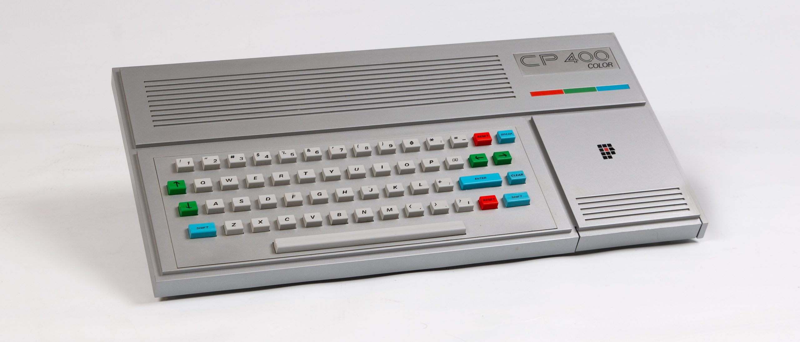
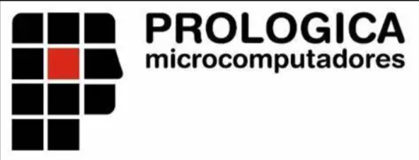
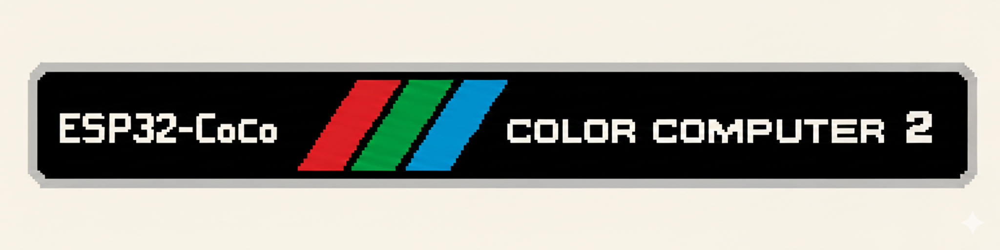

# The Retro Hacker Clone Series: ESP32 CP400

<p align="center">
	
</p>

An open hardware and software project to recreate the spirit of the Prologica CP 400, the Brazilian TRS-80 Color Computer 2 compatible home computer, using a modern ESP32-S3 based design.

This design is part of the Retro Hacker ESP32 Clone Series: a planned collection of ESP32-based recreations of classic Brazilian computers from the 1980s. Each machine in the series focuses on keeping the original character and software culture alive while using practical, buildable modern hardware.

The goal is not to build a museum prop. The goal is to make a usable, hackable CP400-inspired machine: real connectors, real keyboard and joystick paths, VGA output, SD-backed storage, and firmware that can run a CoCo 2 / CP400 style environment on inexpensive contemporary hardware.

## Why CP400?

The Prologica CP 400 was one of the memorable Brazilian home computers of the mid-1980s. Built during Brazil's market-reserve era, it was compatible with the Tandy/Radio Shack TRS-80 Color Computer 2, known as the CoCo 2, but arrived with its own Brazilian industrial design, PAL-M video expectations, local peripherals, translated software, and a very particular place in the local 8-bit scene.

Under the hood, the original CP400 family followed the CoCo architecture closely:

- Motorola MC6809E CPU running around 0.895 MHz
- Motorola MC6847 video display generator
- 16 KB or 64 KB RAM configurations
- Extended Color BASIC in ROM
- Cassette, cartridge, joystick, serial, video, and expansion interfaces
- Optional disk support through the CP450 floppy system

This repository explores that machine from both sides: hardware that gives the emulator a dedicated physical home, and software that recreates the CP400/CoCo experience on an ESP32-S3.

## Heritage

<p align="center">
	
	&nbsp;&nbsp;&nbsp;&nbsp;
	
</p>

The ESP32 CP400 sits between two histories: Prologica's Brazilian CP400 family and the Tandy/Radio Shack CoCo 2 platform that inspired it. The project uses those references as historical anchors while building a new, independent ESP32-based recreation.

## Project Goals

- Preserve the CP400/CoCo 2 experience in a form that can be built, studied, and modified.
- Establish the CP400 entry in the broader ESP32 Clone Series for Retro Hacker.
- Use modern parts where they make sense, especially the ESP32-S3 with PSRAM.
- Provide a KiCad hardware design for a CP400-inspired board and peripheral connectors.
- Run an embedded CoCo 2 style emulator with video, USB input, SD storage, virtual disks, and joystick support.
- Keep the design approachable for retrocomputing builders, hardware hackers, and firmware tinkerers.

## Repository Layout

```text
hardware/ESP32_CP400/          KiCad project for the ESP32 CP400 hardware
hardware/ESP32_CP400/libraries Project-local KiCad symbols and footprints
software/esp32_cp400_emulator/ PlatformIO firmware for the ESP32-S3 emulator
case/                          Mechanical/case work area
```

## Hardware

The KiCad project lives in `hardware/ESP32_CP400` and is named `esp32_cp400`.

The local KiCad libraries are organized inside:

```text
hardware/ESP32_CP400/libraries/symbols
hardware/ESP32_CP400/libraries/footprints
```

The hardware design currently includes project-local footprints and symbols for the ESP32-S3 module, USB connectors, SD card socket, switches, and other board-level parts. The intent is to give the firmware a board that feels more like a small computer than a loose dev kit on a bench.

## Firmware

The firmware lives in `software/esp32_cp400_emulator` and is built with PlatformIO using the Arduino framework for ESP32-S3.

Current software areas include:

- MC6809 emulator core integration
- CoCo 2 / CP400 video mode handling
- VGA output through the ESP32-S3 VGA library
- USB soft-host input support
- SD/MMC storage access
- Virtual floppy disk image handling
- Emulator menu and firmware updater code
- Joystick and keyboard mapping hooks

The PlatformIO environment is configured for an ESP32-S3 DevKitC-style board with 16 MB flash and 8 MB PSRAM:

```ini
[env:esp32-s3-devkitc-1-Modded]
platform = espressif32@6.11.0
board = esp32-s3-devkitc-1-n16r8
framework = arduino
```

The project intentionally pins the Espressif platform version because newer Arduino/ESP32 combinations may change includes and behavior used by the emulator.

## Status

This project is under active development. Expect the hardware, pin mapping, emulator behavior, and documentation to evolve together.

Good entry points:

- Open the KiCad project at `hardware/ESP32_CP400/esp32_cp400.kicad_pro`.
- Open the firmware workspace at `software/esp32_cp400_emulator/esp32_cp400_emulator.code-workspace`.
- Review `software/esp32_cp400_emulator/platformio.ini` before building or uploading.

## ROMs and Original Software

Original CP400, CoCo, Extended Color BASIC, Disk BASIC, cartridge, cassette, and floppy software may still be copyrighted. This repository is for original hardware/firmware work and project files. Bring your own legally obtained ROMs and software images when needed.

## Historical Notes

The CP400 was part of a wider Brazilian TRS-Color ecosystem that included machines such as the Codimex CD-6809, LZ Color 64, Dynacom MX-1600, and Varix VC50. The CP400 became the best-known of the Brazilian CoCo-compatible machines, before the home computer market shifted heavily toward MSX and, later, IBM PC compatibles.

That makes it a particularly interesting target for a modern recreation: it sits at the meeting point of Brazilian microcomputer history, Motorola 6809 elegance, CoCo software culture, and the practical charm of 1980s home computing.

## References and Further Reading

- [Prologica CP-400](https://en.wikipedia.org/wiki/Prol%C3%B3gica_CP-400)
- [CP400](https://pt.wikipedia.org/wiki/CP400)
- [TRS-80 Color Computer](https://en.wikipedia.org/wiki/TRS-80_Color_Computer)
- [Prologica](https://pt.wikipedia.org/wiki/Prol%C3%B3gica)
- [Datassette](https://datassette.org/) for Brazilian retrocomputing manuals, magazines, books, and software preservation material

## License

See `LICENSE.txt` for the repository license. The firmware directory also includes its own `license.txt`; check both before reusing or redistributing project materials.
